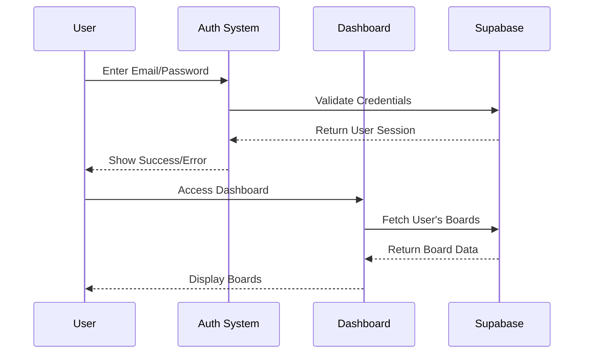
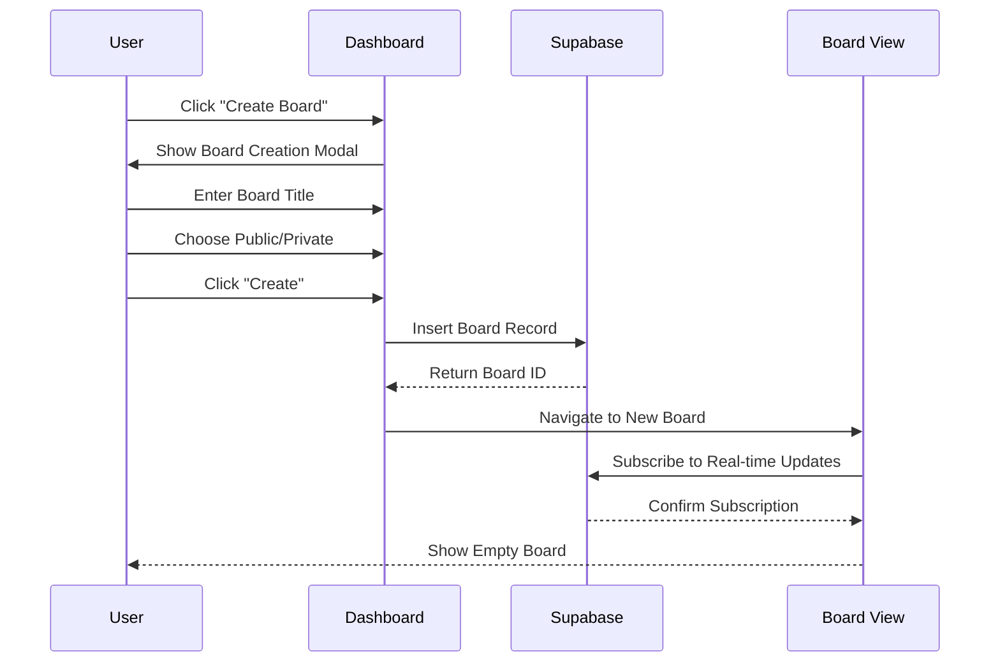
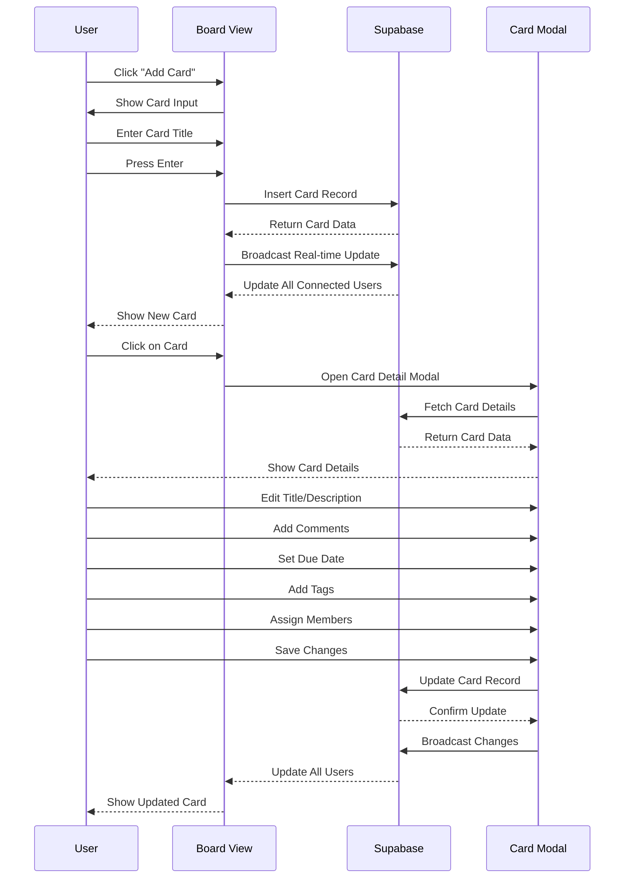
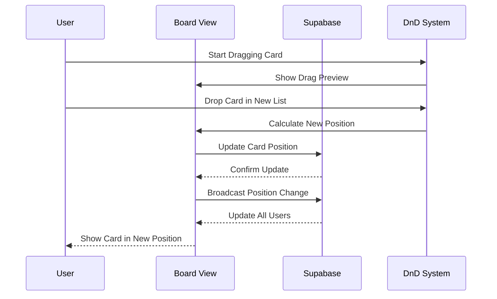
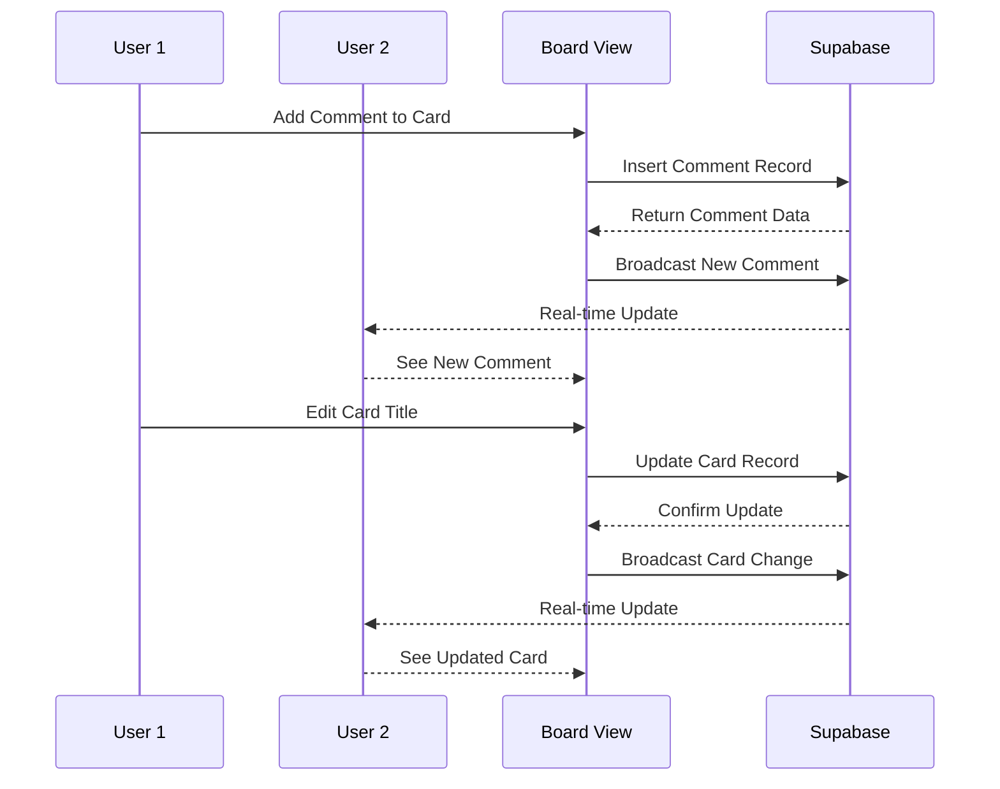

# 🗺️ **TASKLY USER FLOW DIAGRAM**

## 📋 **COMPLETE USER JOURNEY MAP**

```mermaid
graph TD
    A[User Visits Taskly] --> B{Is User Logged In?}

    B -->|No| C[Login/Register Page]
    B -->|Yes| D[Dashboard]

    C --> C1[User Enters Email/Password]
    C1 --> C2{Valid Credentials?}
    C2 -->|No| C3[Show Error Message]
    C3 --> C1
    C2 -->|Yes| D

    D --> D1[View All Boards]
    D1 --> D2[Search Boards]
    D2 --> D3[Create New Board]
    D3 --> D4[Enter Board Title]
    D4 --> D5[Choose Public/Private]
    D5 --> D6[Board Created Successfully]

    D6 --> E[Board View]
    E --> E1[View Lists & Cards]
    E1 --> E2[Add New List]
    E2 --> E3[Enter List Title]
    E3 --> E4[List Created]

    E4 --> F[Card Management]
    F --> F1[Add New Card]
    F1 --> F2[Enter Card Title]
    F2 --> F3[Card Created]

    F3 --> G[Drag & Drop]
    G --> G1[Move Cards Between Lists]
    G1 --> G2[Reorder Lists]
    G2 --> G3[Real-time Updates]

    G3 --> H[Card Detail Modal]
    H --> H1[Edit Card Title]
    H1 --> H2[Edit Description]
    H2 --> H3[Add Comments]
    H3 --> H4[Set Due Date]
    H4 --> H5[Add Tags/Labels]
    H5 --> H6[Assign Team Members]
    H6 --> H7[Save Changes]

    H7 --> I[Collaboration Features]
    I --> I1[Real-time Comments]
    I1 --> I2[Live Updates]
    I2 --> I3[User Notifications]

    I3 --> J[Board Management]
    J --> J1[Edit Board Settings]
    J1 --> J2[Invite Team Members]
    J2 --> J3[Manage Permissions]
    J3 --> J4[Archive Board]

    J4 --> K[User Profile]
    K --> K1[Edit Profile Info]
    K1 --> K2[Upload Avatar]
    K2 --> K3[Update Bio]
    K3 --> K4[Save Profile]

    K4 --> L[Logout]
    L --> L1[Clear Session]
    L1 --> A
```



## 🔄 **DETAILED FEATURE FLOWS**

### **1. 🔐 AUTHENTICATION FLOW**



### **2. 📋 BOARD CREATION FLOW**



### **3. 🃏 CARD MANAGEMENT FLOW**



### **4. 🎯 DRAG & DROP FLOW**



### **5. 💬 COLLABORATION FLOW**



## 🎨 **UI STATE TRANSITIONS**

### **Dashboard States**

```
┌─────────────────┐    ┌─────────────────┐    ┌─────────────────┐
│   Loading       │───▶│   Board Grid     │───▶│   Search Results│
│   (Spinner)     │    │   (All Boards)   │    │   (Filtered)    │
└─────────────────┘    └─────────────────┘    └─────────────────┘
         │                       │                       │
         ▼                       ▼                       ▼
┌─────────────────┐    ┌─────────────────┐    ┌─────────────────┐
│   Error State   │    │ Create Board     │    │   Empty State   │
│   (Try Again)   │    │   (Modal)       │    │   (No Boards)   │
└─────────────────┘    └─────────────────┘    └─────────────────┘
```

### **Board View States**

```
┌─────────────────┐    ┌─────────────────┐    ┌─────────────────┐
│   Loading       │───▶│   Board Content │───▶│   Card Modal     │
│   (Skeleton)    │    │   (Lists/Cards) │    │   (Edit Mode)   │
└─────────────────┘    └─────────────────┘    └─────────────────┘
         │                       │                       │
         ▼                       ▼                       ▼
┌─────────────────┐    ┌─────────────────┐    ┌─────────────────┐
│   Error State   │    │   Drag & Drop   │    │   Settings      │
│   (Retry)       │    │   (Active)      │    │   (Modal)       │
└─────────────────┘    └─────────────────┘    └─────────────────┘
```

## 🔄 **REAL-TIME UPDATE FLOW**

### **Supabase Realtime Channels**

```
User Actions → Database Changes → Triggers → Real-time Broadcast → UI Updates

1. User creates card
   ↓
2. INSERT into cards table
   ↓
3. Database trigger fires
   ↓
4. Supabase Realtime broadcasts change
   ↓
5. All connected clients receive update
   ↓
6. UI updates automatically
```

### **Subscription Channels**

```
📡 Board Updates: board:{boardId}
📡 List Updates: list:{listId}
📡 Card Updates: card:{cardId}
📡 Comment Updates: comment:{cardId}
📡 Member Updates: member:{boardId}
```

## 🎯 **USER INTERACTION PATTERNS**

### **Common User Journeys**

#### **New User Journey**

1. **Landing** → Login/Register
2. **Onboarding** → Create first board
3. **Learning** → Add lists and cards
4. **Collaboration** → Invite team members
5. **Advanced** → Use tags and due dates

#### **Power User Journey**

1. **Quick Access** → Dashboard with search
2. **Efficient Creation** → Keyboard shortcuts
3. **Advanced Features** → Tags, assignments, comments
4. **Team Management** → Member permissions
5. **Analytics** → Board activity tracking

#### **Team Collaboration Journey**

1. **Board Setup** → Create shared board
2. **Member Invitation** → Add team members
3. **Task Assignment** → Assign cards to members
4. **Real-time Updates** → Live collaboration
5. **Progress Tracking** → Monitor completion

## 📊 **DATA FLOW ARCHITECTURE**

```
┌─────────────┐    ┌─────────────┐    ┌─────────────┐
│   Frontend  │◄──►│   Supabase  │◄──►│  PostgreSQL │
│   (React)   │    │   (API)     │    │  (Database) │
└─────────────┘    └─────────────┘    └─────────────┘
       │                   │                   │
       ▼                   ▼                   ▼
┌─────────────┐    ┌─────────────┐    ┌─────────────┐
│   Zustand   │    │  Realtime   │    │   Triggers  │
│   (State)   │    │ (WebSockets)│    │  (Events)   │
└─────────────┘    └─────────────┘    └─────────────┘
```

## 🎨 **VISUAL USER FLOW SUMMARY**

```
START
  ↓
🔐 AUTHENTICATION
  ↓
📋 DASHBOARD
  ↓
🏗️ BOARD CREATION
  ↓
📝 LIST MANAGEMENT
  ↓
🃏 CARD CREATION
  ↓
🎯 CARD DETAILS
  ↓
💬 COLLABORATION
  ↓
🔄 REAL-TIME UPDATES
  ↓
👥 TEAM MANAGEMENT
  ↓
🏷️ TAGS & LABELS
  ↓
📅 DUE DATES
  ↓
🔍 SEARCH & FILTER
  ↓
⚙️ SETTINGS
  ↓
🚪 LOGOUT
```

This user flow diagram shows the complete journey a user takes through Taskly, from initial login to advanced collaboration features! 🚀
